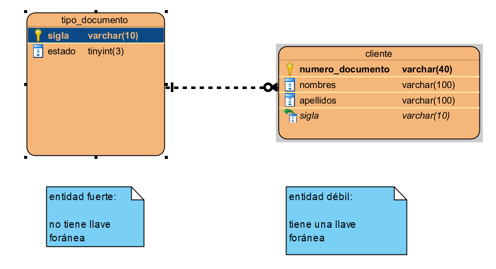

# Diseño

## Entidades Fuertes y Débiles



### Entidad Fuerte

```sql
create table tipo_documento(
    sigla varchar(10),
    estado boolean,
    primary key (sigla)
);
```

### Entidad Débil

```sql
create table cliente
(
    numero_documento varchar(40),
    nombres          varchar(100) NOT NULL,
    apellidos        varchar(100) NOT NULL,
    sigla            varchar(10)  NOT NULL,
    primary key (numero_documento),
    constraint fk_tipo_docu_clie foreign key (sigla) references tipo_documento (sigla)
);
```


